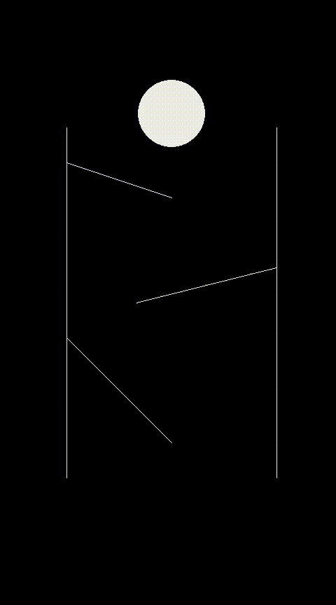

# Ball Toboggan

In addition to solving the proposed exercise in the programming marathon, the objective of this repository is to perform a graphical representation of the problem.

The problem can be seen on the platform Beecrowd: [Problem 1223](https://www.beecrowd.com.br/judge/en/problems/view/1223).

### Requirements
> `Pygame` : pip install pygame

> `Pymunk` : pip install pymunk

### Commands

- `ESC` Close window

